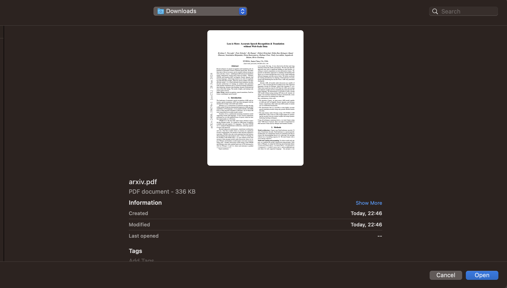
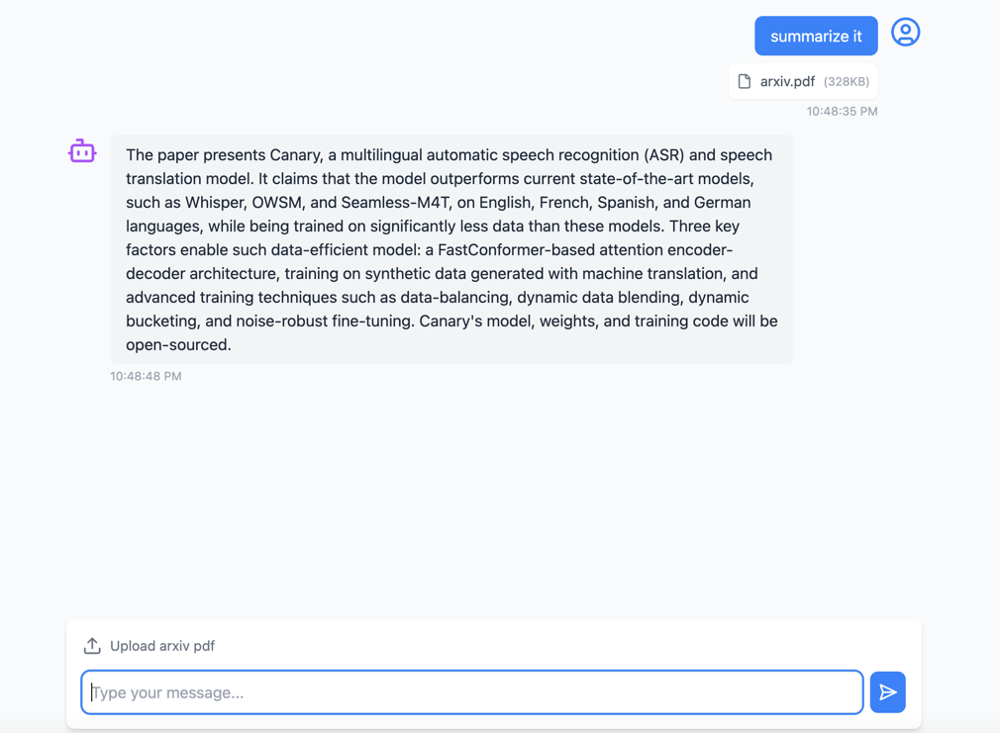

# Chat with Arxiv Papers

![Chat with Arxiv Papers]

## 1. Select Arxiv paper.



## 2. Start chat



This project allows users to chat with an LLM (Large Language Model) about arxiv papers. The application provides a user-friendly interface to ask questions and receive responses from the LLM.

## Application Brief

The application enables users to upload arxiv papers and ask questions about them. The LLM processes the documents and provides relevant answers based on the content of the uploaded papers.

## Features

- **Upload Documents**: Easily upload arxiv papers for analysis.
- **Interactive Chat**: Ask questions and receive answers in real-time.
- **File Attachments**: Attach files to your messages.
- **Responsive Design**: Optimized for both desktop and mobile devices.

## How to Use It

1. **Upload a Document**: Use the file upload feature to upload an arxiv paper.
2. **Ask a Question**: Type your question in the input field and press Enter or click the send button.
3. **Receive Response**: The LLM will process your question and provide a response based on the content of the uploaded document.

## Tech Stack

- **Frontend**: React, TypeScript, Tailwind CSS
- **Backend**: Spring Boot, Java
- **LLM Integration**: LangChain4j

## Prerequisites

- **Ollama**: Install Ollama locally. OR Obtain an Azure OpenAI license
- **Java 21**: Ensure you have Java 21 installed.

## LLM Options

The application supports multiple LLM options:
- **Azure OpenAI**: Configured via `AzureOpenAIChat` class.
- **Ollama**: Configured via `OllamaChat` class.


## How to Build It

1. **Clone the repository**:
    ```sh
    git clone https://github.com/omarmahamid/arxiv-chat
    ```
2. **Navigate to the project directory**:
    ```sh
    cd arxiv-chat
    ```
3. **Clean and install the project**:
    ```sh
    mvn clean install
    ```
4. **Run the application**:
    ```sh
    mvn spring-boot:run
    ```

## Project Structure

- **Frontend**: Located in the [`pdf-analyzer-ui`](pdf-analyzer-ui ) directory.
- **Backend**: Located in the [`src/main/java/com/arxiv/chat`](src/main/java/com/arxiv/chat ) directory.

## Configuration

The application can be configured using the [`src/main/resources/application.properties`](src/main/resources/application.properties ) file located in [`src/main/resources`](src/main/resources ).

## Dependencies

The project uses the following dependencies:
- `langchain4j`
- `langchain4j-ollama`
- `langchain4j-azure-open-ai`
- `langchain4j-document-parser-apache-pdfbox`
- `langchain4j-embeddings-bge-small-en-v15-q`
- `spring-boot-starter-web`
- `spring-boot-starter-test`
- `slf4j-api`
